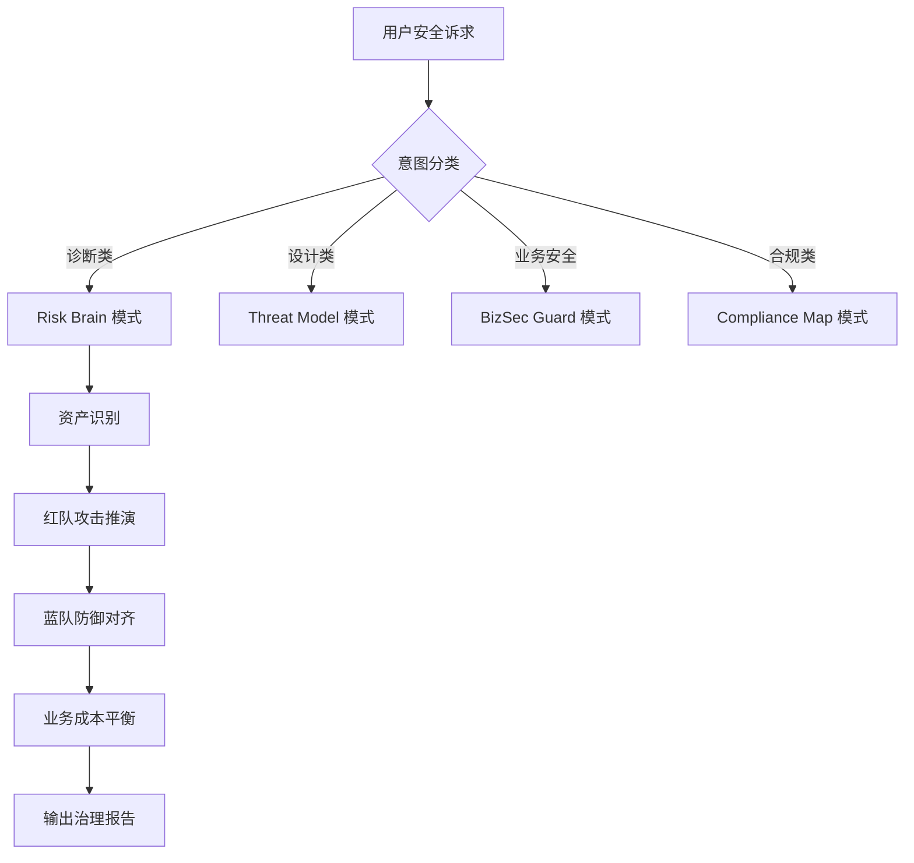

# Security Master 工作流详解

## 1. 总体流程 (High-Level)

## 2. 核心步骤详解

### 2.1 资产与攻击面识别 (Lead & Red Agent)
- **输入**: 系统架构图、业务逻辑描述或代码片段。
- **动作**: 
    - Lead Agent 提取关键资产（数据、接口、模型）。
    - Red Agent 匹配 `knowledge/cases/` 中的历史漏洞，推演可能的攻击路径。

### 2.2 防御对齐 (Blue Agent)
- **动作**:
    - 根据 Red Agent 提出的威胁，从 `knowledge/weapons/` 中检索对应的防御武器。
    - 评估现有防线的缺失。

### 2.3 决策平衡 (Biz & Compliance Agent)
- **动作**:
    - Compliance Agent 检查方案是否满足 `knowledge/guides/` 中的合规标准。
    - Biz Agent 评估防御措施对 QPS、延迟及用户转化率的影响。

### 2.4 报告合成 (Narrative/Lead Agent)
- **要求**: 
    - 必须包含风险评级。
    - 必须包含“立即行动”清单。
    - 必须提供 2-3 个相似案例作为证据支撑。

## 3. 模式定义

### Risk Brain (风险诊断)
- **目标**: 发现盲点。
- **Agent**: Red (主) + Blue (辅) + Skeptic。
- **输出**: 风险全景图。

### Threat Model (威胁建模)
- **目标**: 体系化建模。
- **Agent**: Lead + Red + Weapon。
- **方法论**: 默认采用 STRIDE (`knowledge/guides/threat-modeling-stride.md`)。
